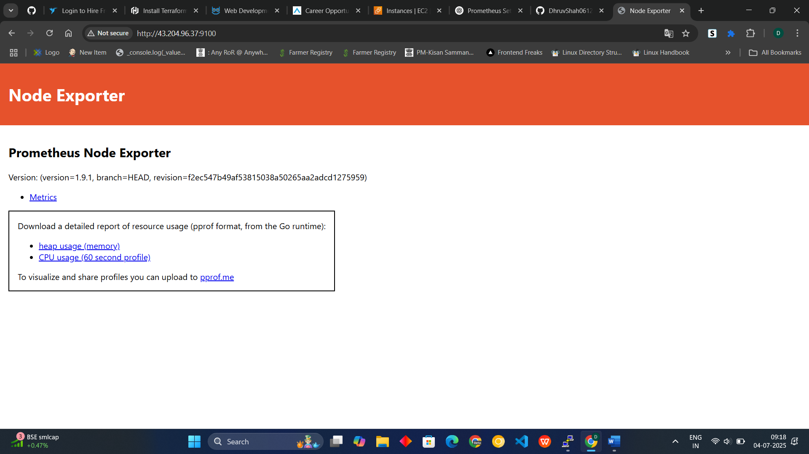
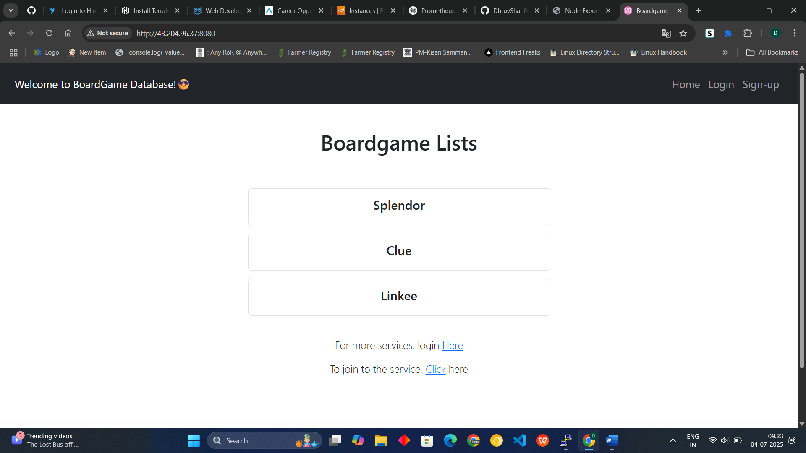
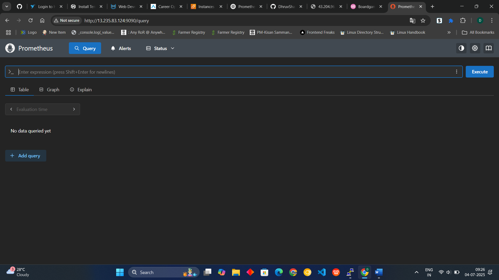
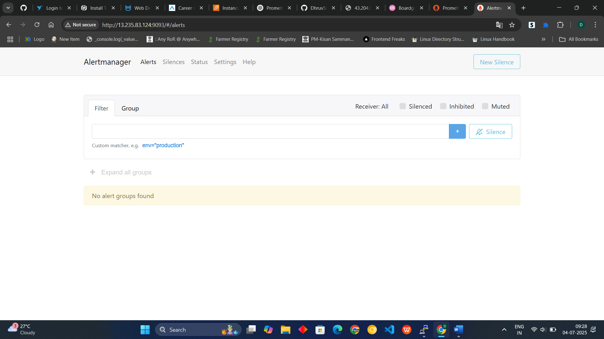
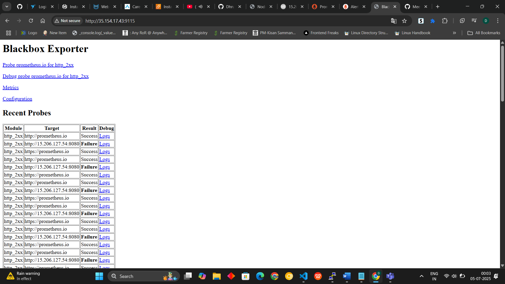
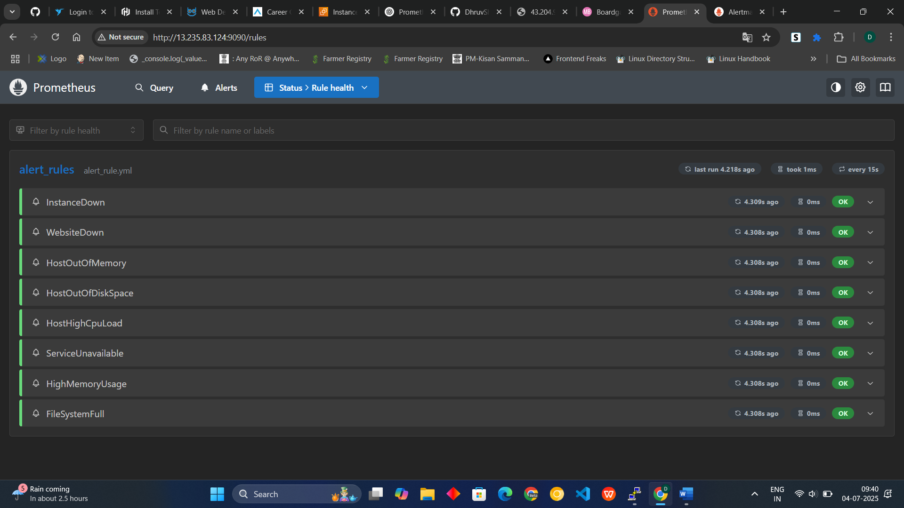
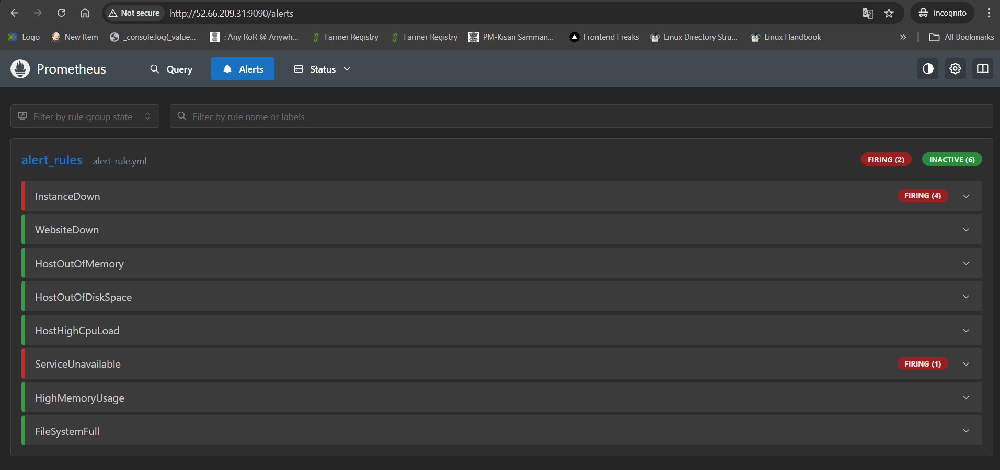
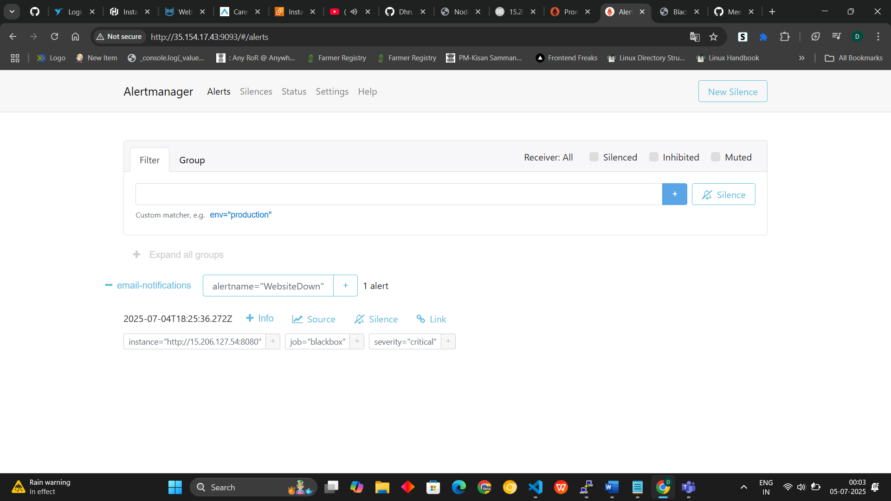
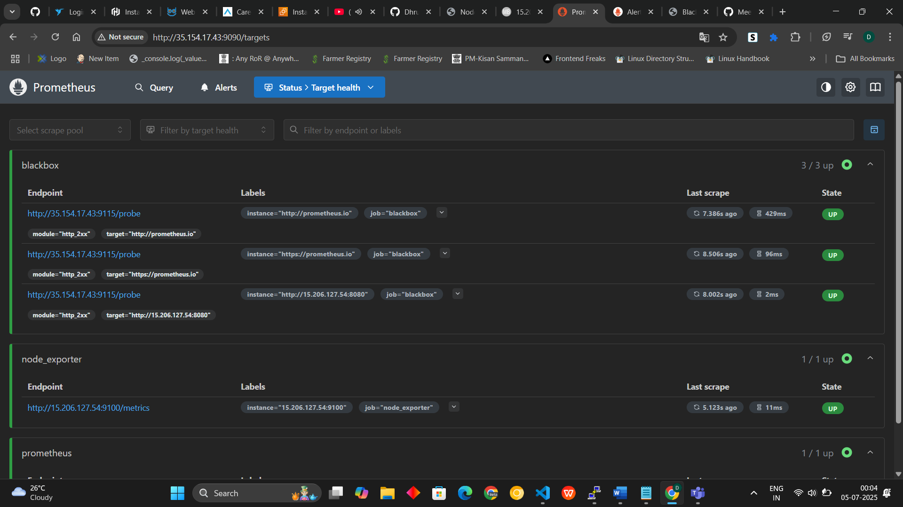
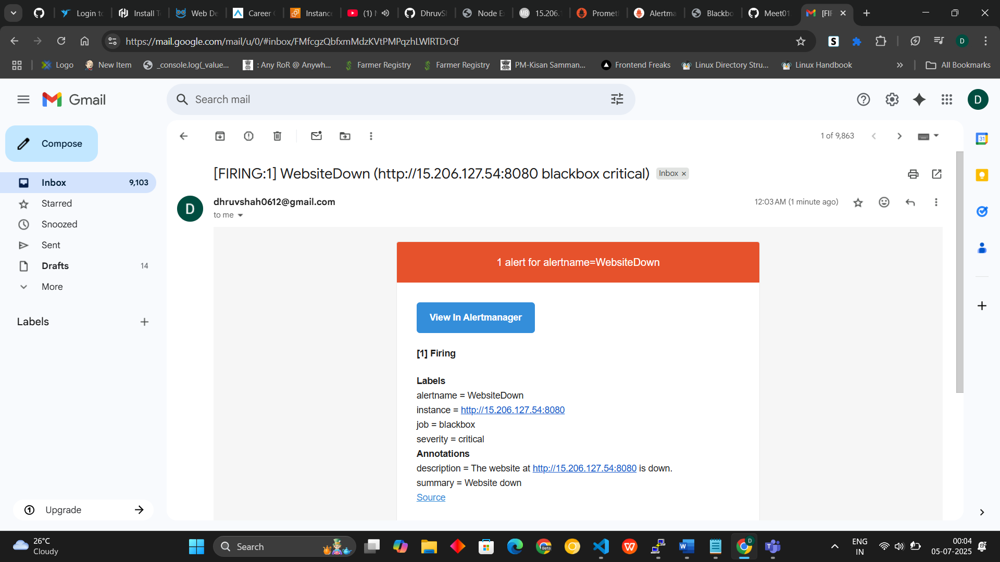

# 🚀 Multi-Instance Monitoring Stack with Prometheus, Node Exporter, Blackbox Exporter, and Alertmanager

A complete, production-ready monitoring and alerting solution for multi-instance infrastructure. This project enables you to monitor system metrics, web endpoints, and receive real-time alerts via Gmail.

---

## 📋 Features

- **Prometheus**: Powerful time-series monitoring and alerting engine.
- **Node Exporter**: Collects Linux system metrics.
- **Blackbox Exporter**: Probes HTTP, HTTPS, and other endpoints.
- **Alertmanager**: Sends alert notifications via Gmail.
- **Java Web App**: Example monitored application.
- **Gmail App Passwords**: Secure email alerting.

---

## 🏗️ Infrastructure Overview

| Instance   | Purpose                       | Tools Installed                              |
|------------|-------------------------------|----------------------------------------------|
| `monitor`  | Monitoring & Alerting Server  | Prometheus, Blackbox Exporter, Alertmanager  |
| `vm`       | Target server to be monitored | Node Exporter, Java Web App                  |

---

## 🚦 Step-by-Step Setup

### 1️⃣ Create 2 Ubuntu EC2 Instances

- Open ports:  
  - 9090 (Prometheus)  
  - 9093 (Alertmanager)  
  - 9115 (Blackbox Exporter)  
  - 9100 (Node Exporter)  
  - 8080 (Java App)

---

### 2️⃣ On `monitor` Instance: Install Monitoring Stack

```bash
sudo apt update
```

**Install Prometheus**
```bash
wget https://github.com/prometheus/prometheus/releases/download/v3.5.0-rc.0/prometheus-3.5.0-rc.0.linux-amd64.tar.gz
tar -xvf prometheus-3.5.0-rc.0.linux-amd64.tar.gz
sudo rm prometheus-3.5.0-rc.0.linux-amd64.tar.gz
sudo mv prometheus-3.5.0-rc.0.linux-amd64 Prometheus
```

**Install Blackbox Exporter**
```bash
wget https://github.com/prometheus/blackbox_exporter/releases/download/v0.27.0/blackbox_exporter-0.27.0.linux-amd64.tar.gz
tar -xvf blackbox_exporter-0.27.0.linux-amd64.tar.gz
rm blackbox_exporter-0.27.0.linux-amd64.tar.gz
mv blackbox_exporter-0.27.0.linux-amd64 blackbox
```

**Install Alertmanager**
```bash
wget https://github.com/prometheus/alertmanager/releases/download/v0.28.1/alertmanager-0.28.1.linux-amd64.tar.gz
tar -xvf alertmanager-0.28.1.linux-amd64.tar.gz
sudo rm alertmanager-0.28.1.linux-amd64.tar.gz
sudo mv alertmanager-0.28.1.linux-amd64 alertmanager
```

---

### 3️⃣ On `vm` Instance: Install Node Exporter & Java Web App

**Node Exporter**
```bash
wget https://github.com/prometheus/node_exporter/releases/download/v1.9.1/node_exporter-1.9.1.linux-amd64.tar.gz
tar -xvf node_exporter-1.9.1.linux-amd64.tar.gz
rm node_exporter-1.9.1.linux-amd64.tar.gz
mv node_exporter-1.9.1.linux-amd64 node_exporter
cd node_exporter
./node_exporter &
```
- Access: `http://<vm_ip>:9100`

---

## 🖼️ Output Example



---

**Java Web App**
```bash
sudo apt install openjdk-17-jre-headless -y
sudo apt install maven -y
git clone <YOUR_REPO>
cd <YOUR_REPO>
mvn package
cd target/
java -jar database_service_project-0.0.3-SNAPSHOT.jar &
```
- Access: `http://<vm_ip>:8080`

---

## 🖼️ Output Example



---

### 4️⃣ On `monitor`: Start Monitoring Stack

```bash
cd Prometheus
./prometheus &
```
- Access: `http://<monitor_ip>:9090`
  


```
cd ../alertmanager
./alertmanager &
```
- Access: `http://<monitor_ip>:9093`



```
cd ../blackbox
./blackbox_exporter &
```
- Access: `http://<monitor_ip>:9115`



# http://<monitor_ip>:9115

---

### 5️⃣ Create `alert_rule.yml` for Prometheus

```bash
cd ../Prometheus
nano alert_rule.yml
```

```yaml
groups:
- name: alert_rules
  rules:
  - alert: InstanceDown
    expr: up == 0
    for: 1m
    labels:
      severity: critical
    annotations:
      summary: "Endpoint {{ $labels.instance }} down"
      description: "{{ $labels.instance }} of job {{ $labels.job }} has been down for more than 1 minute."
  - alert: WebsiteDown
    expr: probe_success == 0
    for: 1m
    labels:
      severity: critical
    annotations:
      summary: "Website down"
      description: "The website at {{ $labels.instance }} is down."
  - alert: HostOutOfMemory
    expr: (node_memory_MemAvailable / node_memory_MemTotal) * 100 < 25
    for: 5m
    labels:
      severity: warning
    annotations:
      summary: "Host out of memory (instance {{ $labels.instance }})"
      description: "Node memory is filling up (< 25% left)\nVALUE = {{ $value }}\nLABELS: {{ $labels }}"
  - alert: HostOutOfDiskSpace
    expr: (node_filesystem_avail{mountpoint="/"} * 100) / node_filesystem_size{mountpoint="/"} < 50
    for: 1s
    labels:
      severity: warning
    annotations:
      summary: "Host out of disk space (instance {{ $labels.instance }})"
      description: "Disk is almost full (< 50% left)\nVALUE = {{ $value }}\nLABELS: {{ $labels }}"
  - alert: HostHighCpuLoad
    expr: (sum by (instance) (irate(node_cpu{job="node_exporter_metrics", mode="idle"}[5m]))) < 20
    for: 5m
    labels:
      severity: warning
    annotations:
      summary: "Host high CPU load (instance {{ $labels.instance }})"
      description: "CPU load is > 80%\nVALUE = {{ $value }}\nLABELS: {{ $labels }}"
  - alert: ServiceUnavailable
    expr: up{job="node_exporter"} == 0
    for: 2m
    labels:
      severity: critical
    annotations:
      summary: "Service Unavailable (instance {{ $labels.instance }})"
      description: "The service {{ $labels.job }} is not available\nVALUE = {{ $value }}\nLABELS: {{ $labels }}"
  - alert: HighMemoryUsage
    expr: (node_memory_Active / node_memory_MemTotal) * 100 > 90
    for: 10m
    labels:
      severity: critical
    annotations:
      summary: "High Memory Usage (instance {{ $labels.instance }})"
      description: "Memory usage is > 90%\nVALUE = {{ $value }}\nLABELS: {{ $labels }}"
  - alert: FileSystemFull
    expr: (node_filesystem_avail / node_filesystem_size) * 100 < 10
    for: 5m
    labels:
      severity: critical
    annotations:
      summary: "File System Almost Full (instance {{ $labels.instance }})"
      description: "File system has < 10% free space\nVALUE = {{ $value }}\nLABELS: {{ $labels }}"
```

---

### 6️⃣ Configure `prometheus.yml`

```
nano prometheus.yml
```

```yaml
global:
  scrape_interval: 15s
  evaluation_interval: 15s

alerting:
  alertmanagers:
    - static_configs:
        - targets:
            - <monitor_ip>:9093

rule_files:
  - "alert_rule.yml"

scrape_configs:
  - job_name: "prometheus"
    static_configs:
      - targets: ["localhost:9090"]
        labels:
          app: "prometheus"
  - job_name: "node_exporter"
    static_configs:
      - targets: ["<vm_ip>:9100"]
  - job_name: "blackbox"
    metrics_path: /probe
    params:
      module: [http_2xx]
    static_configs:
      - targets:
          - http://prometheus.io
          - https://prometheus.io
          - http://<vm_ip>:8080
    relabel_configs:
      - source_labels: [__address__]
        target_label: __param_target
      - source_labels: [__param_target]
        target_label: instance
      - target_label: __address__
        replacement: <monitor_ip>:9115
```

---

### 7️⃣ Restart Prometheus & Alertmanager

```bash
# Restart Prometheus
pgrep prometheus
kill <pid>
./prometheus &

# Restart Alertmanager
pgrep alertmanager
kill <pid>
./alertmanager &
```

---

### 8️⃣ Configure Alertmanager for Gmail
```
cd ../alertmanager/
nano alertmanager.yml
```

```yaml
global:
  smtp_smarthost: 'smtp.gmail.com:587'
  smtp_from: 'yourmail@gmail.com'
  smtp_auth_username: 'yourmail@gmail.com'
  smtp_auth_password: 'your_app_password'

route:
  group_by: ['alertname']
  group_wait: 30s
  group_interval: 5m
  repeat_interval: 1h
  receiver: 'email-notifications'

receivers:
  - name: 'email-notifications'
    email_configs:
      - to: 'yourmail@gmail.com'
        send_resolved: true

inhibit_rules:
  - source_match:
      severity: 'critical'
    target_match:
      severity: 'warning'
    equal: ['alertname', 'dev', 'instance']
```

---

## 🧪 Testing & Output

- **Simulate Downtime:**  
  On `vm` run: `pkill java`  
  You should receive a Gmail alert for WebsiteDown.
- **Restore Service:**  
  Restart your Java app and receive a resolved alert.

---










## 📊 Monitoring UI Access

| Service         | URL                          |
|-----------------|-----------------------------|
| Prometheus      | http://<monitor_ip>:9090     |
| Alertmanager    | http://<monitor_ip>:9093     |
| Blackbox Probe  | http://<monitor_ip>:9115     |
| Java Web App    | http://<vm_ip>:8080          |
| Node Exporter   | http://<vm_ip>:9100          |

---

## 📬 Gmail App Password Setup

1. Enable 2FA on your Gmail account.
2. Visit: [Google App Passwords](https://myaccount.google.com/apppasswords)
3. Generate a new app password for "Mail".
4. Use it in your `alertmanager.yml`.

---
